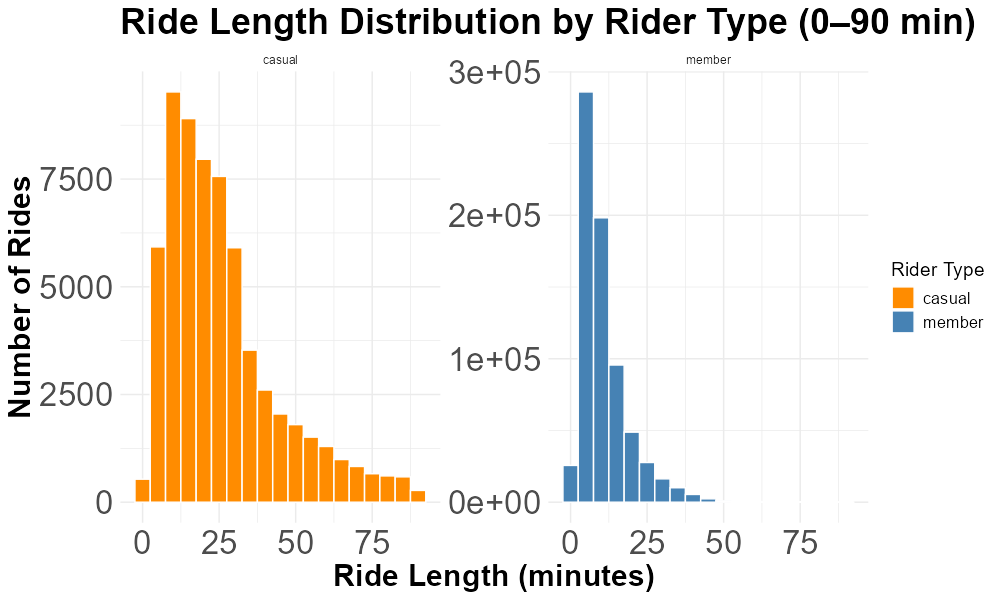
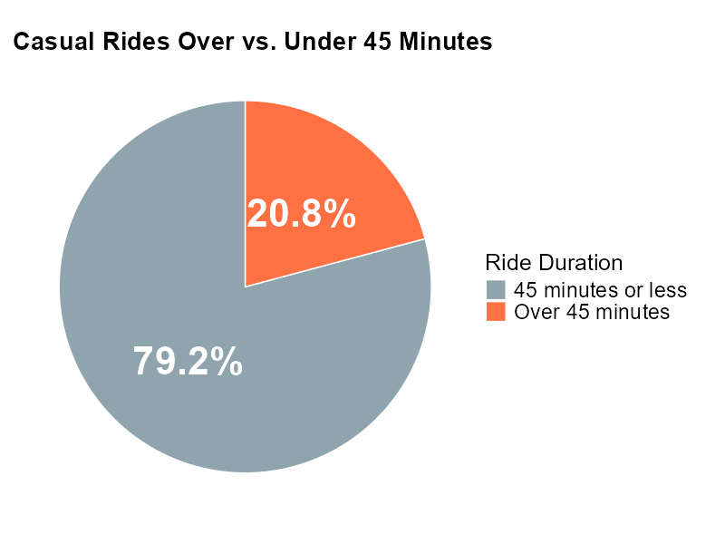
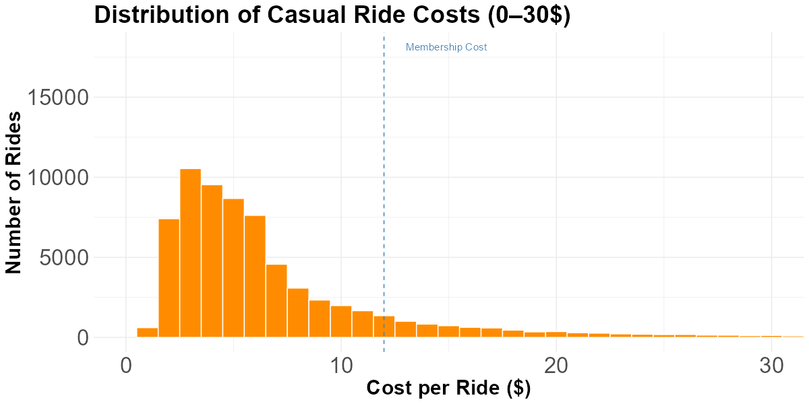
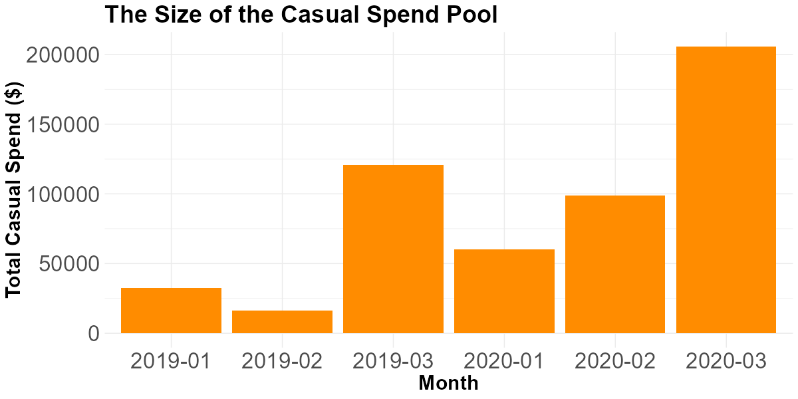
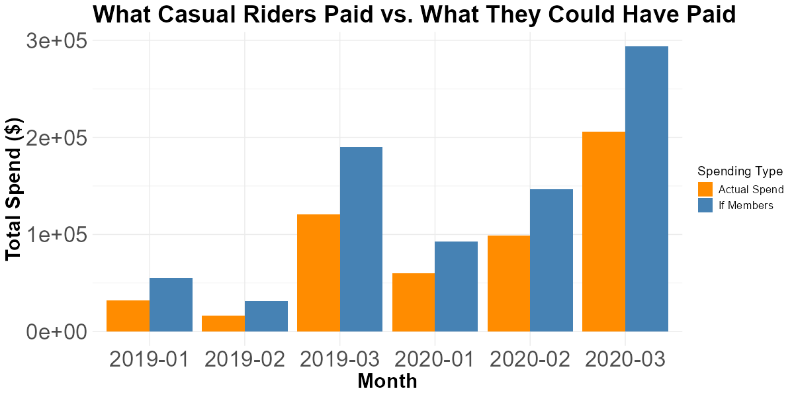
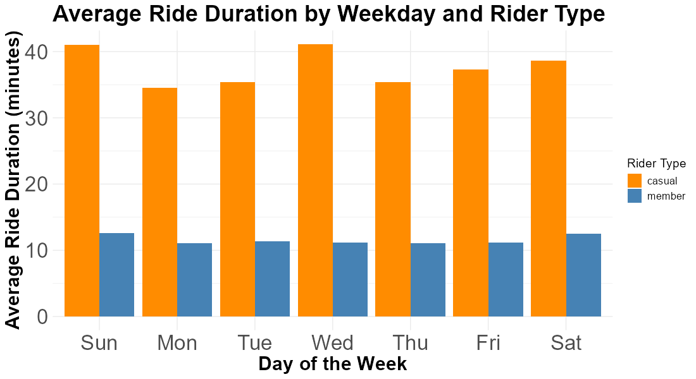
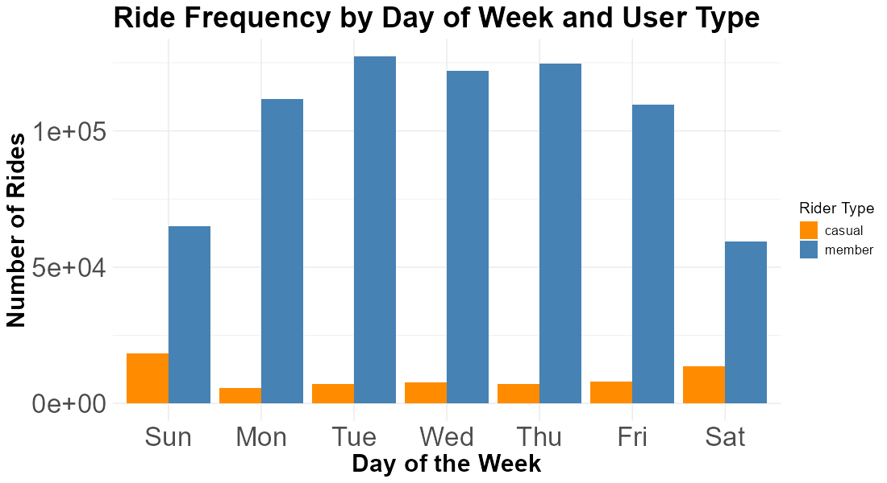

# 🚲 Cyclistic Case Study – Converting Casual Riders to Members

## 📘 About This Project

This capstone project is part of the Google Data Analytics Certificate. It uses 15 months of Divvy/Cyclistic bike-share data to explore how casual riders differ from annual members and proposes strategies to convert high-value casual users into loyal subscribers.

---

## 🔍 Business Task

**Goal:** Help Cyclistic increase revenue by converting more casual riders into annual members.

**Primary Question:**  
*How do casual riders and annual members use Cyclistic bikes differently, and what actionable insights can increase membership conversion?*

---

## 🧰 Tools Used

- **Language:** R  
- **Libraries:** tidyverse, lubridate, scales  
- **Platform:** RStudio (Cloud), GitHub  
- **Visualization:** ggplot2

---

## 🧼 Data Cleaning and Preparation

- Merged 15 months of ride data (2019 Q1 to 2020 Q1)
- Standardized column names and formats
- Removed missing values and erroneous records (e.g. negative durations)
- Derived new variables: `ride_length`, `weekday`, `casual_cost`

---

## 📊 Key Visualizations & Insights

### 1️⃣ Ride Length Distribution (0–90 min)

- Casual riders show a wider distribution of ride lengths
- Casual rides tend to be longer, especially at the high end

---

### 2️⃣ Casual Rides Over vs. Under 45 Minutes

- 21% of casual rides last **over 45 minutes**
- This segment represents a **high-value conversion opportunity**

---

### 3️⃣ Casual Ride Cost Distribution

- Many casual riders pay **between $5 and $15 per ride**
- A substantial portion exceeds the $11.99 monthly membership cost
- One long ride can cost **more than a full month of membership**

---

### 4️⃣ Monthly Casual Spending

- The **casual rider pool** represents a sizable revenue stream
- High overall casual spending justifies targeting this group

---

### 5️⃣ Actual vs. Hypothetical Member Spend

- Casual riders often spend **more** than the flat-rate membership
- The gap = **missed savings** for users and **lost recurring revenue** for Cyclistic

---

### 6️⃣ Average Ride Duration by Weekday

- Casual rides are longer than member rides **on every day**
- Peak ride durations on weekends suggest **leisure behavior**

---

### 7️⃣ Ride Frequency by Weekday

- Casual rides spike on **weekends**
- Weekends offer a prime window for **conversion offers**

---

## 💡 Strategic Takeaways

- **High-value casual riders** (21% over 45 mins) are overspending vs. membership
- Their behavior is **leisure-oriented**, not commuter-driven
- Cyclistic can **leverage this segment** with targeted offers
- Conversion = **user savings** + **stable recurring revenue** for Cyclistic

---

## ✅ Recommended Actions

- 🎯 Launch **weekend-focused trial campaigns** for casual riders  
- ⏱️ Offer **time-limited discounts** to users with high per-ride spend  
- 💬 Promote **flat-rate savings** in-app at point of purchase  
- 🔁 Add **incentives for long-ride casuals** to join within 24 hours

---

## 🧠 Learnings

This project strengthened my skills in:
- Data wrangling with `dplyr`
- Aggregation, visualization, and storytelling with `ggplot2`
- Deriving business value from raw operational data

---

## 📂 Project Files

- `cyclistic_case_study_final.R` – R script for full analysis  
- `README.md` – Overview and insights (this file)  
- `images/` – Folder with all final charts

---

## 🔗 GitHub Repository

> 📍 [[[https://github.com/FrancescoMarchi/cyclistic-case-study](https://github.com/FrancescoMarchi/cyclistic-case-study)](https://github.com/FrancescoMarchi/cyclistic_case_study.git)](https://github.com/FrancescoMarchi/cyclistic_case_study.git)

---

To see the full project with data included, visit the Kaggle version:
📁 [Cyclistic Case Study on Kaggle] https://www.kaggle.com/code/francescomarch/cyclistic-case-study

---

> 🚨 Note: Raw data files are not included in this repository due to size and licensing considerations.
> 
> You can download the original datasets directly from [Divvy Bike Data Portal](https://divvy-tripdata.s3.amazonaws.com/index.html).

## 🔚 Version

**Version:** `v1.2`  
**Date:** July 2025
